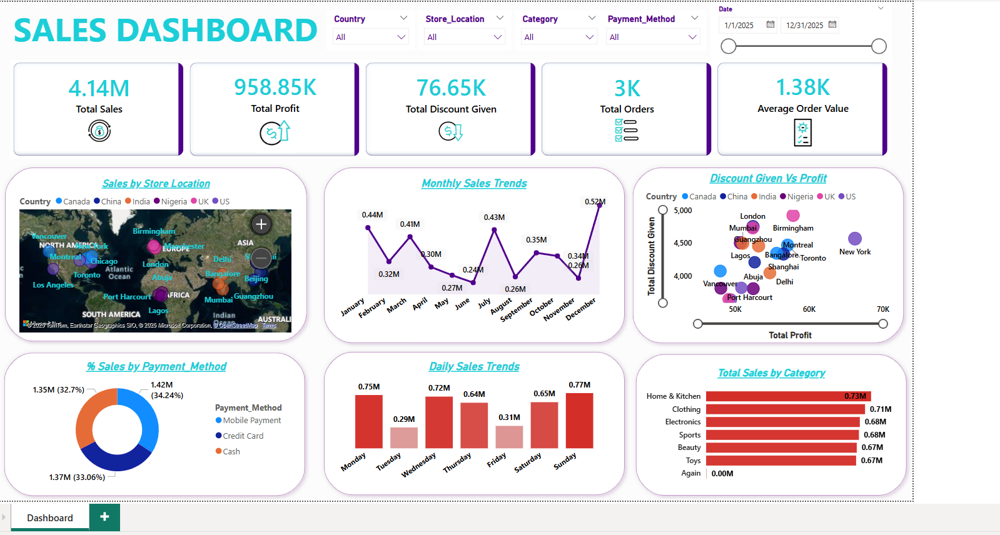

# Sales Performance Analysis using SQL Server & Power BI

This project explores a retail sales dataset using **SQL Server** for data analysis and **Power BI** for visualizations. The goal is to extract actionable business insights across countries, products, and sales teams.

## Dashboard Preview

---

## 🛠 Tools & Technologies

- **SQL Server** – For data cleaning, transformation & querying  
- **Power BI** – For creating interactive dashboards & visualizations  
- **Excel** – For raw data storage and verification  
---

## 📁 Project Overview

This project involves:
- Cleaning and combining sales data from 6 countries
- Performing SQL analysis to answer business questions
- Creating visual dashboards in Power BI for easy insight delivery

---

## 🔍 Dataset Details

The sales data is split into 6 country-wise sheets/tables:
- `India_Sales`, `UK_Sales`, `USA_Sales`, `Nigeria_Sales`, `Canada_Sales`, `China_Sales`

Each table contains sales-related columns:
- `Transaction_id`, `Date`, `Country`, `Product_id`, `Product_Name`, `Category`, `Price_Per_Unit`, `Quantity_Purchased`, `Cost_Price`, `Discount_Applied`, `Payment_Method`, `Customer_Age_Group `, `Customer_Gender`, `Store_Location`, `Sales_Rep`, `Total_Amount` `Profit`
## 📊 Analysis Workflow

### 1️⃣ Data Merging & Cleaning (SQL)
- Merged all country datasets using `UNION ALL`
- Standardized column formats and names
- Removed nulls and duplicates

### 2️⃣ Business Analysis (SQL)
- Calculated `Total_Sales`
- Calculated `Profit`
- Analyzed:
  - Total sales by country
  - Top 5 best-selling products
  - Sales rep performance
  - Region-wise profitability
  - Impact of discount on sales

### 3️⃣ Visualization (Power BI)
Created a fully interactive Power BI dashboard including:
- Sales by Country
- Top Products by Revenue
- Monthly Trends
- Sales Rep Performance
- Discount vs Sales Analysis
- KPI Cards for Revenue, Quantity, Profit

---

## 📈 Key Insights

- **UK** generated the highest revenue across all countries.
- **Product A, B, and C** were consistently top performers.
- **Sales Rep R1** had the highest monthly conversion.
- Discounts had a mixed effect on overall profit.
- **Germany's** regional store was the most profitable.

---

## 📌 Conclusion

This project shows how to combine **SQL** and **Power BI** for effective data analysis and storytelling. SQL handled the heavy lifting of data prep and analysis, while Power BI provided a visual and interactive platform to communicate insights clearly.

---

## 👤 Author

**Ravish Kumar**  
📍 Patna, Bihar  
💼 Data Analyst – SQL | Python | Power BI  | Excel
🔗 [LinkedIn](#) | 📬 [Email](#)

---

